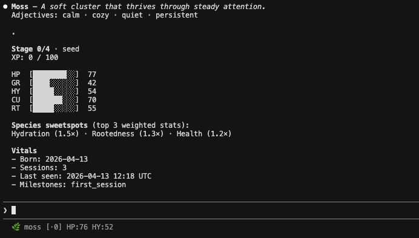

# Habitat

Habitat is a Claude Code companion system. It gives you a living plant that evolves as you code.



## What it does

- Adds a `/habitat` command that renders your plant in chat.
- Stores plant state locally at `~/.habitat/plant.json`.
- Uses hooks to react to Claude Code events and update stats over time.
- Loads all species behavior from `species/*.json` (data-driven, no hardcoded species logic).

## Local-only by design

- No remote sync.
- No web dashboard.
- No permanent death state (plants become dormant and can recover).

## Requirements

- `bash`
- `jq`

## Claude CLI Compatibility

- Minimum supported Claude CLI: `1.0.0` (declared in `claude-plugin.json`).

## Install

Recommended (plugin-first):

```bash
claude plugin add eshraw/habitat
```

Then run:

```text
/hbt:init
```

Compatibility fallback (repository install script):

```bash
./install.sh
```

Installer behavior:

- Creates `~/.claude/hooks`, `~/.claude/commands`, and `~/.habitat` if needed.
- Copies hooks and command template into your Claude directories.
- Is idempotent: re-running updates files without duplicate setup.
- Prints plugin-first guidance (`claude plugin add habitat` + `/hbt:init`).

## Hook behavior (v1)

- `PostToolUse` + `bash_tool`: increases hydration, and curiosity for new command patterns.
- `PostToolUse` + `str_replace`/`create_file`: increases growth and rootedness.
- `PostToolUse` + `web_search`: increases curiosity.
- `Notification` success: increases health (bounded to max).
- `Stop`: applies decay, increments sessions, and updates milestones.

## Verification

Run both scripts after changes:

```bash
./scripts/validate_species.sh
./scripts/verify_hooks.sh
./scripts/verify_plugin_flow.sh
./scripts/verify_migration.sh
```

What they verify:

- Species schema shape and required fields.
- State initialization, event mutations, and stop-session behavior.
- Hooks remain silent on stdout (non-interactive behavior).
- Plugin metadata and `/hbt:init` idempotency.
- Migration fallback behavior for users coming from script-based setup.
